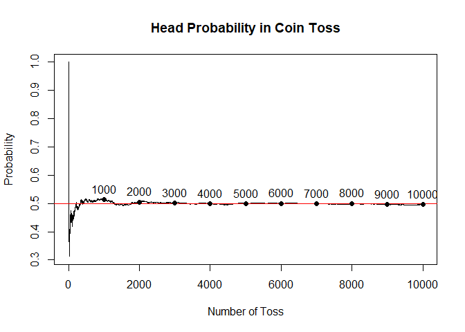
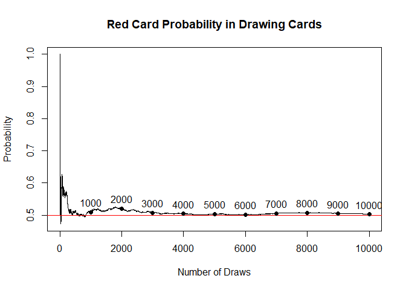
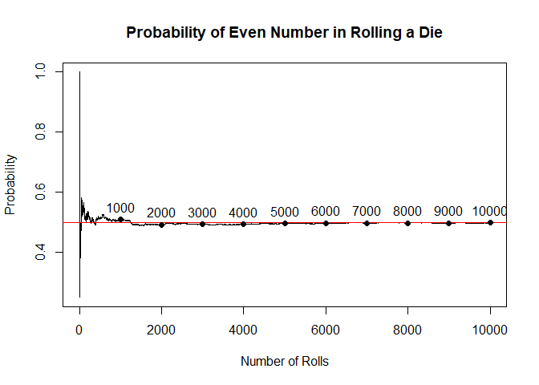

APM1110 - FA 2 - Dacanay
================
Jordan Dacanay

### 1) Use R to illustrate that the probability of getting:

\###(a) a head is 0.5 if a fair coin is tossed repeatedly; \####
Probability Table

``` r
# NUmber of sample
n_sample <- 10000

# Simulate 100 coin tosses
print('Let Head = 1 and Tail = 0')
```

    ## [1] "Let Head = 1 and Tail = 0"

``` r
y <- sample (c(1, 0), n_sample, replace = TRUE)

# Probability Table
fair_coin_probability <- table(y)/n_sample
fair_coin_probability
```

    ## y
    ##      0      1 
    ## 0.5042 0.4958

#### Probability Plot

``` r
num <- 1:n_sample
# Partial Probability
partial_events <- cumsum(y)
partial_probability <- partial_events / num

# Plot
plot(num, partial_probability, type = "l",
xlab = "Number of Toss", ylab = "Probability",
main = "Head Probability in Coin Toss")
abline(h=0.5, col="red")

# Add labels for each number of toss
hundredth_points <- seq(1000, max(num), by = 1000)
text(hundredth_points, partial_probability[hundredth_points], labels = hundredth_points, pos = 3)
points(hundredth_points, partial_probability[hundredth_points], col = "black", pch = 16)
```

<!-- -->

\###(b) a red card is 0.5 if cards are drawn repeatedly with replacement
from a well-shuffled deck; \####Probability Table

``` r
# Simulate 50 card draws
print('Let Red = 1 and Black = 0')
```

    ## [1] "Let Red = 1 and Black = 0"

``` r
# Define the deck
deck <- c(rep(1, 26), rep(0, 26))
draws <- sample(deck, n_sample, replace = TRUE)

# Probability Table
red_card_probability <- table(draws)/n_sample
red_card_probability
```

    ## draws
    ##      0      1 
    ## 0.4974 0.5026

#### Probability Plot

``` r
num <- 1:n_sample
# Partial Probability
partial_events <- cumsum(draws)
partial_probability <- partial_events / num

# Plot
plot(num, partial_probability, type = "l",
xlab = "Number of Draws", ylab = "Probability",
main = "Red Card Probability in Drawing Cards")
abline(h=0.5, col="red")

# Add labels for each number of toss
text(hundredth_points, partial_probability[hundredth_points], labels = hundredth_points, pos = 3)
points(hundredth_points, partial_probability[hundredth_points], col = "black", pch = 16)
```

<!-- -->

\###(c) an even number is 0.5 if a fair die is rolled repeatedly.
\####Probability Table

``` r
# Simulate 50 die rolls
print('Let Even Numbers (2, 4, 6) = 1 and Odd Numbers (1, 3, 5) = 0')
```

    ## [1] "Let Even Numbers (2, 4, 6) = 1 and Odd Numbers (1, 3, 5) = 0"

``` r
# Define the deck
dice <- c(rep(1, 3), rep(0, 3))
rolls <- sample(dice, n_sample, replace = TRUE)

# Probability Table
fair_die_probability <- table(rolls)/n_sample
fair_die_probability
```

    ## rolls
    ##      0      1 
    ## 0.5016 0.4984

\####Probability Plot

``` r
num <- 1:n_sample
# Partial Probability
partial_events <- cumsum(rolls)
partial_probability <- partial_events / num

# Plot
plot(num, partial_probability, type = "l",
xlab = "Number of Rolls", ylab = "Probability",
main = "Probability of Even Number in Rolling a Die")
abline(h=0.5, col="red")

# Add labels for each number of toss
text(hundredth_points, partial_probability[hundredth_points], labels = hundredth_points, pos = 3)
points(hundredth_points, partial_probability[hundredth_points], col = "black", pch = 16)
```

<!-- -->

### 2) An experiment consists of tossing two fair coins. Use R to simulate this experiment 100 times and obtain the relative frequency of each possible outcome. Hence, estimate the probability of getting one head and one tail in any order.

``` r
# Generate Sample Spaces
states <- c("H", "T")
S <- expand.grid(states, states)
sample_spaces <- apply(S, 1, paste, collapse = "")

# Simulate 100 coin tosses
x <- sample(sample_spaces, 100, replace = TRUE)

# Calculate relative frequencies
coin_toss_probability <- table(x) / 100
print('Coin Toss Probability Table')
```

    ## [1] "Coin Toss Probability Table"

``` r
coin_toss_probability
```

    ## x
    ##   HH   HT   TH   TT 
    ## 0.22 0.27 0.26 0.25

``` r
# Probability of one head and one tail
probability_HT_TH <- coin_toss_probability["HT"] + coin_toss_probability["TH"]

# Print the combined probability
print('Probability of One Head and One tail')
```

    ## [1] "Probability of One Head and One tail"

``` r
probability_HT_TH
```

    ##   HT 
    ## 0.53

``` r
# Probability in percentage
print('Probability of One Head and One Tail in Percentage:')
```

    ## [1] "Probability of One Head and One Tail in Percentage:"

``` r
print(sprintf("%.2f%%", probability_HT_TH * 100))
```

    ## [1] "53.00%"
